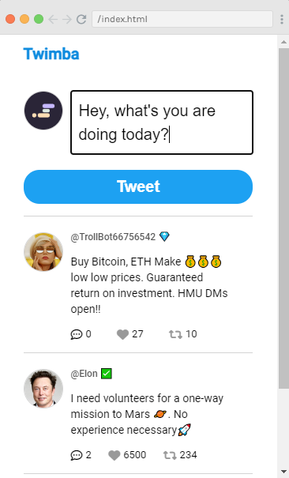
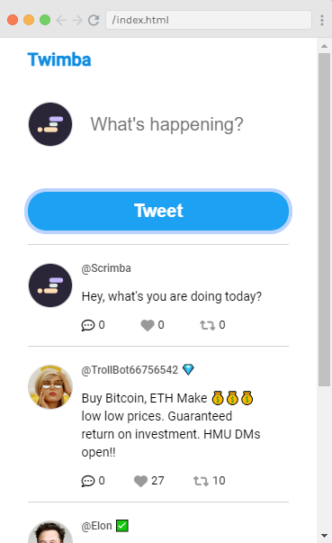
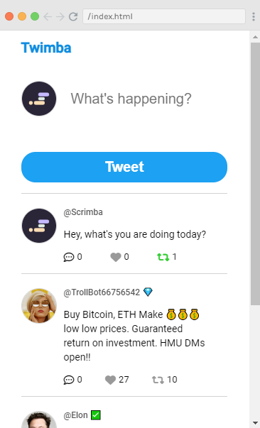
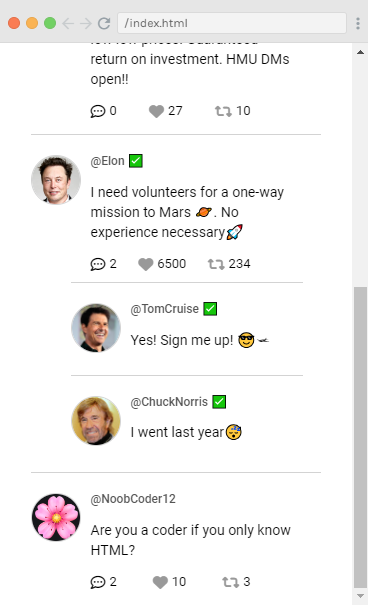

# Project: Twimba (Twitter Clone)
It is a web application that is clone of the world's most famous website "twitter". 

## Features:
- User's can make a new tweet
- show previous tweets
- User's can read replies of particular tweet
- User's can like, share, and retweet
- User's can dislike, and cancel share
- change of color on buttons on like, share, replies 
- use of icons from Font Awesome CDN
- generate uuid from UUID CDN
- a nice user-friendly interface

## Tech Stack:
- HTML
- CSS
- JavaScript
- Fontawesome CDN
- UUID CDN

## Output:
          
        
        

Happy Coding!
